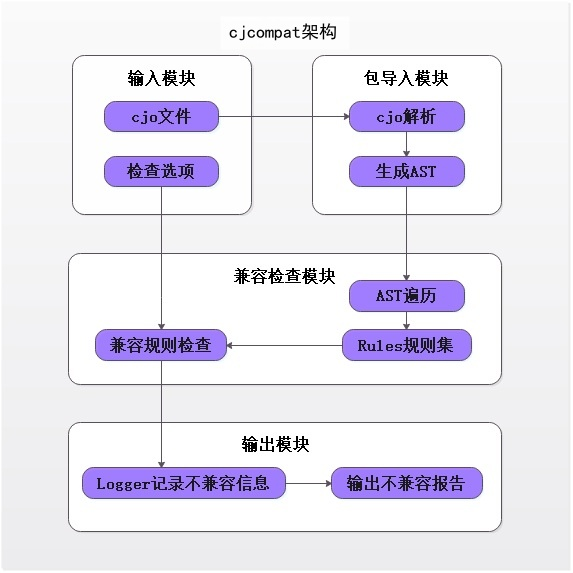

# 仓颉兼容检查工具开发者指南

## 开源项目介绍

`cjcompat (Cangjie Compatible)` 仓颉兼容检查工具是一款基于仓颉语言 `Library Evolution` 规范开发的 `ABI` / `API` 兼容检查工具。其整体技术架构如图所示：



## 目录

` cjcompat ` 源码目录如下图所示，其主要功能如注释中所描述。
```
cjcompat/
|-- build                       # 构建脚本
|-- doc                         # 介绍文档
    |-- library_evolution_spec  # 仓颉模块演进兼容性规范
|-- include                     # 源码相关头文件
|-- src
    |-- CheckersAndRules        # 检查规则源码
    |-- CjoLoader               # cjo文件解析
    |-- Diff                    # AST差异识别
    |-- Dsl                     # 公共模块
    |-- Logger                  # 检查结果
    |-- Option                  # 命令行选项
```

## 安装和使用指导

`cjcompat` 需要以下工具来构建：

- `clang` 或者 `gcc` 编译器

### 构建准备

`cjcompat` 构建依赖 `cjc`, 构建方式参见[SDK 构建](https://gitcode.com/Cangjie/cangjie_build/blob/dev/README_zh.md)

### 构建步骤

本地构建流程如下：

1. 通过 `git clone` 命令获取 `cjcompat` 的最新源码：

    ```shell
    cd ${WORKDIR}
    git clone https://gitcode.com/Cangjie/cangjie_tools.git
    ```

2. 配置环境变量：

    ```shell
    export CANGJIE_HOME=${WORKDIR}/cangjie    (for Linux/macOS)
    set CANGJIE_HOME=${WORKDIR}/cangjie       (for Windows)
    ```

    `cjcompat` 的编译依赖 `cangjie` 仓的编译产物, 因此需要配置环境变量 `CANGJIE_HOME` 指定 `SDK` 的位置。上述 `${WORKDIR}/cangjie` 仅作为示意，请根据 `SDK` 的实际位置进行调整。

   > **注意：**
   >
   > - `Windows` 的环境变量配置需要正确使用目录分隔符，并确认路径中的中文字符被正确识别和处理。

3. 通过 `cjcompat/build` 目录下的构建脚本编译 `cjcompat`：

    ```shell
    cd cangjie-tools/cjcompat/build
    python3 build.py build -t release
    ```

    当前支持 `debug`、`release` 两种编译类型，开发者需要通过 `-t` 或者 `--build-type` 指定。

4. 安装到指定目录：

    ```shell
    python3 build.py install
    ```

    默认安装到 `cjcompat/dist` 目录下，支持开发者通过 `install` 命令的参数 `--prefix` 指定安装目录：

    ```shell
    python3 build.py install --prefix ./output
    ```

    编译产物目录结构为:

    ```
    dist/
    |-- bin
        `-- cjcompat                   # 可执行文件，Windows 中为 cjcompat.exe
    ```

5. 验证 `cjcompat` 是否安装成功：

    ```shell
    ./cjcompat -h
    ```

    开发者进入安装路径的 `bin` 目录下执行上述操作，如果输出 `cjcompat` 的帮助信息，则表示安装成功。注意，可执行文件 `cjcompat` 依赖 `cangjie-lsp` 动态库，请将库路径配置到系统动态库环境变量中。以 `Linux` 环境为例：

    ```shell
    export LD_LIBRARY_PATH=$CANGJIE_HOME/tools/lib:$LD_LIBRARY_PATH
    ./cjcompat -h
    ```

6. 清理编译中间产物：

   ```shell
   python3 build.py clean
   ```

当前同样支持 `Linux` 平台交叉编译 `Windows` 下运行的 `cjcompat` 产物，构建指令如下：

```shell
export CANGJIE_HOME=${WORKDIR}/cangjie
python3 build.py build -t release --target windows-x86_64
python3 build.py install
```

执行该命令后，构建产物默认位于 `cjcompat/dist` 目录下。请注意从 `Linux` 平台交叉编译获取 `Windows` 平台的产物，则需要的 `SDK` 为 `Windows` 版本。

### 更多构建选项

`python3 build.py build` 命令也支持其它参数设置，具体可通过如下命令来查询：

```shell
python3 build.py build -h
```

## 检查工具使用说明

`cjcompat` 提供以下主要命令，用于检查 `ABI` / `API` 兼容性是否变更。

### 命令介绍

使用命令行操作 `cjcompat --old cjofile --new cjofile` 。

`cjcompat -h` 帮助信息，选项介绍。

```text
Usage:
       cjcompat --old /path/to/old.cjo --new /path/to/new.cjo [--api] [--abi] [--import-path /path]
Options:
   -h                      Show usage
                               eg: cjcompat -h
   --old <value>           Path to the .cjo file corresponding to the old version of a Cangjie library.
   --new <value>           Path to the .cjo file corresponding to the new version of a Cangjie library.
                               eg: cjcompat --old filePathOld --new filePathNew
   --import-path <value>   Add .cjo search path.
   --api                   Enforces rules for API compatibility.
   --abi                   Enforces rules for ABI compatibility.
                               eg: cjcompat --old filePathOld --new filePathNew --api
```

### 兼容规则检查

`cjcompat --old cjofile --new cjofile`

- 检查不同版本的 `cjo` 是否兼容，`cjofile` 支持相对路径和绝对路径。

```shell
cjcompat --old old.cjo --new new.cjo
```

> **说明：**
>
> 规则检查时必须指定 `--old` 和 `--new` 选项且仅允许出现一次，否则报错。
> 不同版本 `cjofile` 必须以 `.cjo` 结尾，否则报错。
> 不同版本 `cjofile` 必须是兼容版本内 `cjc` 编译生成的，否则可能因版本不兼容而出现 `cjo` 文件解析错误。
> 不指定检查规则类型时，默认 `api` 和 `abi` 规则都检查。
> 如果出现 `Cannot load file old.cjo` 报错提示，则可能还依赖其他 `cjo` 文件，可以通过使用 `CANGJIE_PATH` 环境变量或 `--import-path` 来指定依赖的 `cjo` 文件路径。

### api 兼容规则检查

`cjcompat --api`

- 选项 `--api` 让用户指定仅检查 `api` 兼容规则。

```shell
cjcompat --old old.cjo --new new.cjo --api
```

### abi 兼容规则检查

`cjcompat --abi`

- 选项 `--abi` 让用户指定仅检查 `abi` 兼容规则。

```shell
cjcompat --old old.cjo --new new.cjo --abi
```

## 相关仓

- [cangjie 仓](https://gitcode.com/Cangjie/cangjie_compiler)
- [SDK 构建](https://gitcode.com/Cangjie/cangjie_build)