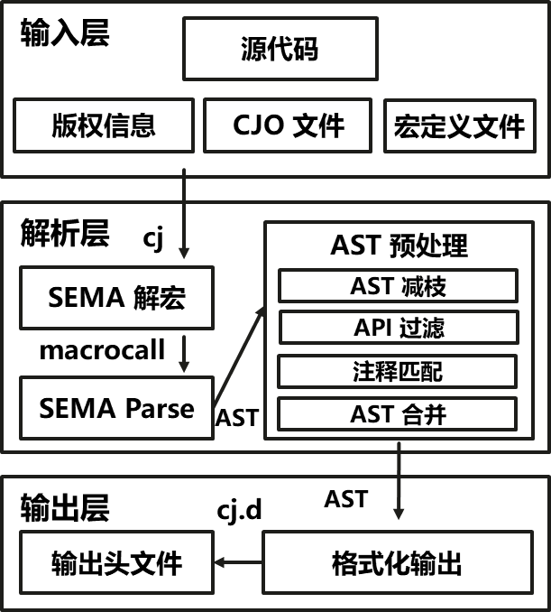

# cjhead

## 开源项目介绍

`CJHead(Cangjie Head)`是仓颉 header file 生成工具：扫描仓颉源文件，生成对应头文件 cj.d。其整体技术架构如图所示：



## 目录

` cjhead ` 源码目录如下图所示，其主要功能如注释中所描述。
```
cjhead/
|-- build                   # 构建脚本
|-- config                  # 配置文件
|-- doc                     # 介绍文档
|-- fmt                     # 格式化工具
|-- include                 # 头文件
│-- src                     # 源码
```

## 导出规则

### Package

- 无修饰符的 package：默认 public
- public 修饰的 package
- protected package 里面按下述规则对外可见的 API，且该 API 在其他 public 包内被 public import

### Import

- 无修饰符的 import
- public import
- protected/internal/private import

### Macro

- public 修饰的全局 macro

### Class / Struct / Enum / Interface

- public/sealed 修饰的 class
- public 修饰的 struct
- public 修饰的 enum
- public/sealed 修饰的 interface

### Variable

- public 修饰的全局变量
- public class/struct 中 public 修饰的成员变量
- sealed class 中 public 修饰的成员变量
- public(但非 sealed) open/abstract class 的 protected 成员变量：因为在子类中可见

### Type Alias

- public 修饰的全局类型别名

### Function

- public 修饰的全局函数
- public/sealed 修饰的 class/struct/interface/enum 中的 public 修饰的成员函数
- public/sealed interface 中无修饰符的成员函数（interface中无修饰符=public）
- public(但非 sealed) open/abstract class 的 protected 修饰的成员函数：因为在子类中可见

### Property

- public/sealed class/struct/interface/enum 中的 public 修饰的成员 prop
- public/sealed interface 中无修饰符成员 prop（interface中无修饰符=public）
- public(但非sealed) open/abstract class 的 protect 修饰的成员 prop：因为在子类中可见

### Extend

- extend 的 public 成员，extend 与被扩展类型在同一个包（无论是否是接口扩展），被扩展类型是 public 的，扩展的泛型约束里用到的类型是 public 的
- extend 的 public 成员，extend 是接口扩展，接口与被扩展的类型不在同一个包，被扩展类型是 public 的，接口是 public 的，扩展的泛型约束中用到的类型也是 public 的，且该成员继承自被扩展的 public 接口
- extend 的 protected 成员，extend 与被扩展类型在同一个包（无论是否是接口扩展），被扩展类型是 public(但非 sealed) open/abstract class，扩展的泛型约束里用到的类型是public的

### Comment & Annotation

- 单行注释、多行注释
- 可见声明对应的注解

### Macro Expansion

- 宏展开的函数

## 编译构建

### 基于源代码构建

下载并编译 cangjie 置于 third_party/cangjie 下

```bash
git clone <your cangjie repo> ./third_party/cangjie

cd ./third_party/cangjie

./build.py build --no-tests --cjnative -t release --enable-assert

./build.py install

source ./output/envsetup.sh

```

编译 cjhead

```bash
mkdir output && cd output && cmake .. && make
```

输出见 output 目录下的 bin

### 基于构建脚本构建

执行构建脚本

```bash
python build/build.py
```

完成一键构建，其中构建的配置文件位于 config/config.ini

配置文件的内容如下

```ini
[project]
# 构建环境的根目录
root = ./

[cangjie]
# repo of cangjie.
repo = <Your Cangjie repo>
# branch of cangjie repo.
branch = dev

[paths]
# 拷贝的 cangjie repo 存储路径
cangjie_dir = third_party/cangjie
# build 产物的存储路径
build_dir = build
cangjie_build_script = build.py
envsetup_sh = output/envsetup.sh
cjhead_src_dir = third_party

[build]
# 是否在构建时开启 test 模式
no_tests = true
# 是否在构建时开启 cjnative 模式
cjnative = true
# 是否在构建时开启 debug 模式
target = debug
# 是否在构建时开启 assert
enable_assert = true
```
